# Nombre Proyecto : ABM-Clientes-Angular7-Spring5

------------------------------------------------------------------------------
## Funcionalidades del proyecto

Las funcionalidades más importantes del proyecto son :
  * Para usuarios con rol "Admin" :
    - Login de usuario
    - Registro usuario
    - Listado de clientes y modificación de su foto de perfil
    - ABM de los clientes
    - ABM de las facturas con sus correspondientes : líneas de facturas , productos , cantidad , usuario

  * Para usuarios con rol "Usuario" :
    - Login de usuario
    - Registro usuario
    - Listado de clientes y vista de su perfil
    - Listado de facturas de los clientes

* Para usuarios no logueados :
  - listado de clientes

* <ins><b>Usuario con rol "Administrador" creado por defecto en el sistema:</b></ins>
    - <b>Username : admin</b>
    - <b>Password : 12345</b>
    
* <ins><b>Usuario con rol "Usuario" creado por defecto en el sistema:</b></ins>
    - <b>Username : andres</b>
    - <b>Password : 12345</b>

------------------------------------------------------------------------------
### Lenguajes , Frameworks , BD

* El proyecto del lado del Backend esta compuesto por una Api Rest con Spring Framework 5 y Spring Boot 2.

* Asi mismo en el FrontEnd esta desarrollado con Angular 7 , que es un framework para aplicaciones web desarrollado en TypeScript.

* La seguridad del sistema esta determinado por usuarios cuyos respectivos roles determina las acciones posibles a realizar en dicha aplicación ,
  esta seguridad esta implementada del lado del BackEnd por Spring Security mediante la api de OAuth2 en conjunto con JWT.

* La validación y la integridad de los datos al ser alterados se verifican para su correcto prosesamiento tanto del lado del cliente como del servidor.

* La BD que se implementa para dicha ocasión es MySql.

------------------------------------------------------------------------------

### Imagenes Del Proyecto

#### Para usuarios con rol "Usuario" :
* Página de Bienvenida

    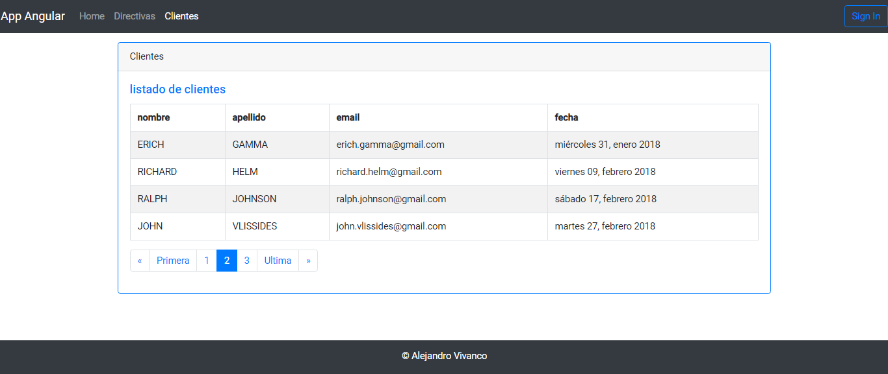

* Página de Login

    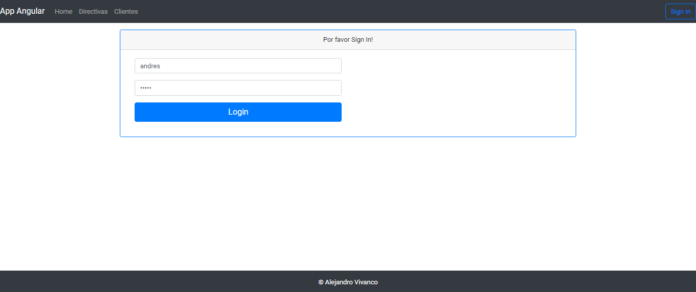

* Página de Listado de Clientes

    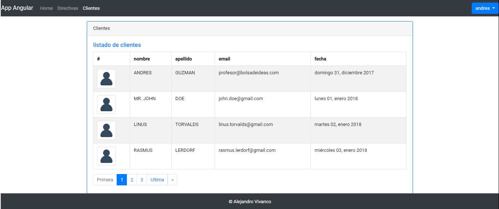

* Página de Perfil de los clientes

    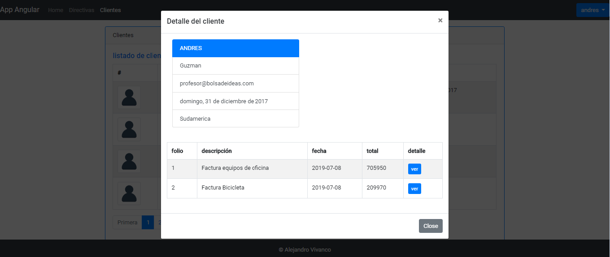

----------------------------------------------------------

#### Para usuarios con rol "Admin" :
*  Página de Listado de Clientes

    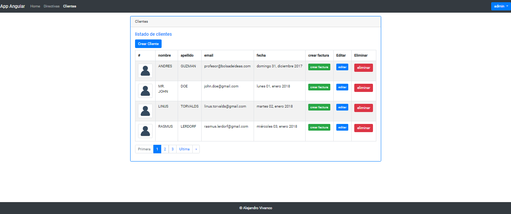

* Página Nuevo Cliente

    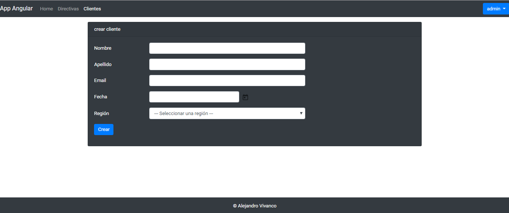

* Página Nuevo Cliente("con validaciones incorrectas")

    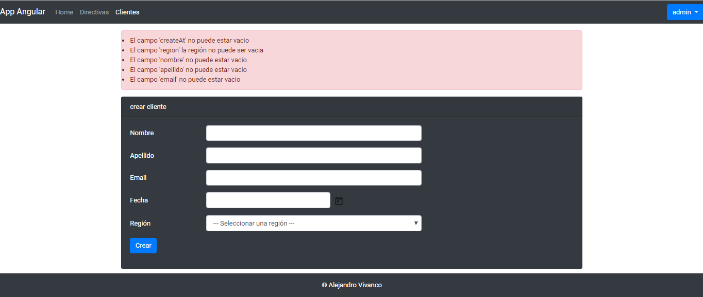

* Página de Perfil de los clientes

    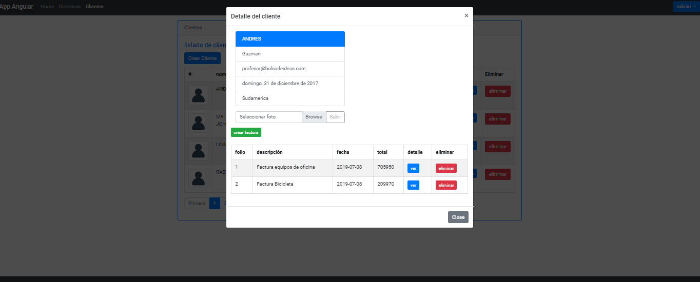

* Página de Nueva Factura

    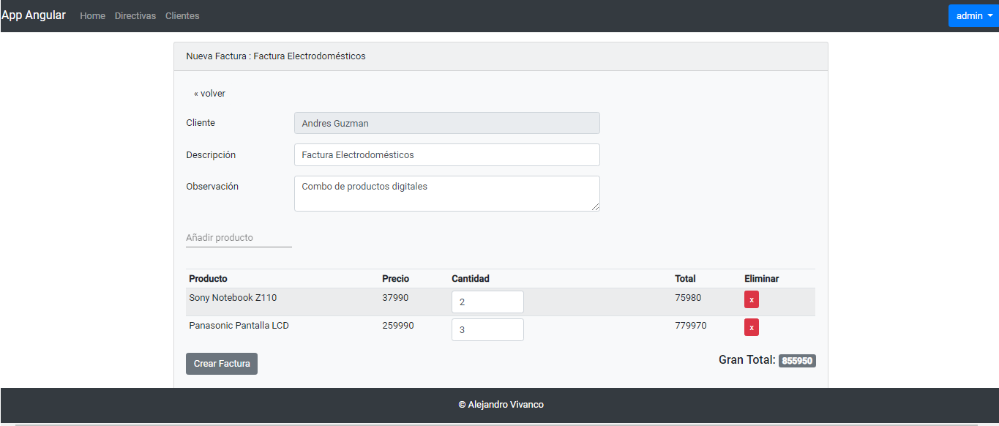

* Página de Nueva Factura("con validaciones incorrectas")

    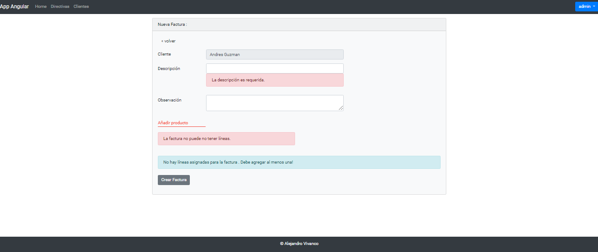

* Página de Nueva Factura("con éxito")

    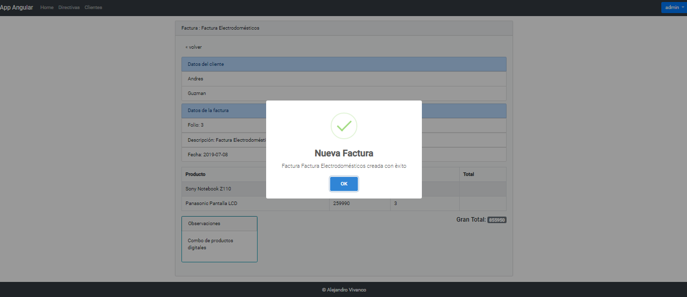

